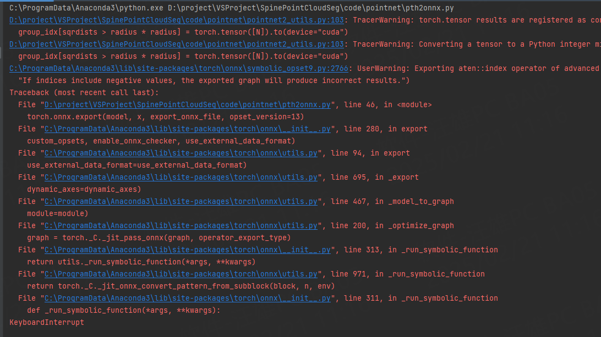

# 将pytorch的.pth文件转换成 onnx文件

## 将PointNet++的模型文件转成onnx的时候出错
    
    导出失败

## 将PointNet的模型文件转成onnx，成功了

## 完成基于C++实现的脊柱椎弓根通道规划
## 测试用时：

    GPU下，单个椎体规划用时10s左右,包含生成actor及保存图片,去除生成actor及保存图片，估计用时2~5s.
    CPU下，单个椎体规划用时20s左右，包含生成actor及保存图片
    

## 导出模型文件,运行下面脚本
    python pth2onnx.py
## 文件夹说明
    code_c：文件夹下是C版的椎弓根螺钉通道规划
    code_cpp：文件夹下是C++版的椎弓根螺钉通道规划

## 椎弓根螺钉通道规划
    由三个类实现，分别为SpinePointCloudSeg、SpineRegistrationICP和PedicleSurgeryPlanning。
    其中SpinePointCloudSeg这个类是使用点云识别的方法对单椎体的特征点进行识别；SpineRegistrationICP是
    使用基于PCA+ICP配准的方法，来识单椎体的特征点；PedicleSurgeryPlanning这个类是基于特征点进行椎弓根螺钉通道规划的。

### 方法一：基于点云识别的方法
    该方法是利用点云识别模型识别左、右椎弓根峡部特征点和顶面特征点，然后再进行椎弓根螺钉通道规划。
    

### 方法二：基于PCA+ICP配准的方法
    该方法是利于PCA+ICP算法，将待规划椎段与模板椎段进行配准，将模板椎段上的特征点映射到待配准椎段上，然后再进行椎弓根螺钉通道规划。

### 方法异同：
    两种方法主要是获取特征点的方式不同，后面的规划是相同的。

### 粗配准方法对比
    两种粗配准方法：
#### 1.基于PCA的粗配准方法(点云距离)：
    原理：通过计算点云的PCA轴，将PCA轴对齐，实现粗配准。
    优点：考虑了缩放，针对相似形状（体积大小存在差异），有较好的粗配准效果。
    不足：无法兼容局部配准的情况
    用时：在单椎体上测试，单个配准用时在0.4s左右

#### 2.基于open3d的Fast Global Registration方法(点云特征匹配)：
    原理：通过计算点的特征，进行配对，然后非线性优化，得到最终的配对点云，再计算配对点云。
    优点：通过特征提取，对局部配准也有较好的效果。
    不足：没考虑缩放情况，对有相似形（体积大小不同的），配准结果不稳定。
    用时：在单椎体上测试，单个配准用时0.1~1.0s不等

